

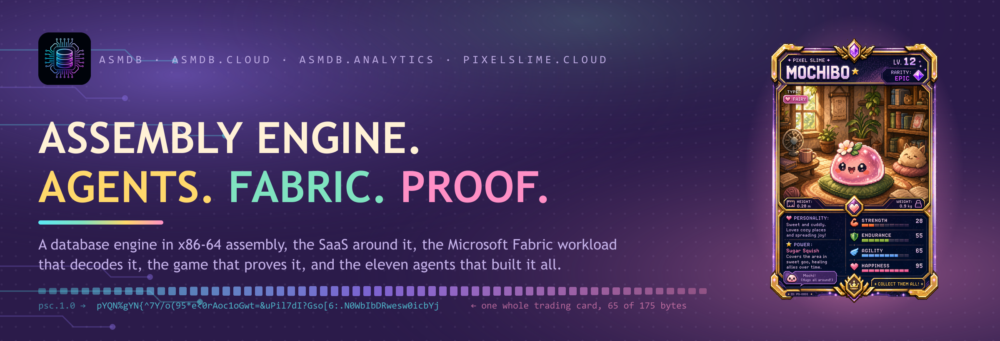

**A database engine written in x86-64 assembly, the SaaS built around it, the Microsoft Fabric workload that decodes it, the game that proves the whole chain works — and the eleven agents that built it all.**

**[⬇ Download the keynote (PPTX, 84 slides)](deck/PixelSlime-asmdb-Keynote.pptx)** · **[⬇ Read it as PDF](deck/PixelSlime-asmdb-Keynote.pdf)**

---

## This repository is the story, not the code

Five systems were built. Each one is useful on its own. Together they answer a question that is easy to ask and unusually hard to prove:

> **If you write a database engine from scratch, can you still get all the way to a semantic model in Microsoft Fabric — without a single line of it being a demo?**

The answer turned out to be yes, and this repository is the narrative of how. The code lives in three sibling repositories. What lives *here* is the argument, the deck, and the pictures.

| | What it is | Where it lives |
|---|---|---|
| **asmdb** | A transactional database engine in x86-64 assembly. 43,741 bytes. No libc. | [github.com/fredgis/asmDB](https://github.com/fredgis/asmDB) |
| **asmdb.cloud** | The SaaS around it. One database, one Container App, one public door. | [www.asmdb.cloud](https://www.asmdb.cloud) |
| **asmdb.analytics** | A Microsoft Fabric workload that syncs and decodes asmdb into Lakehouse Delta tables. | [github.com/fredgis/asmDB](https://github.com/fredgis/asmDB) |
| **PixelSlime** | One AI-generated slime a day, forever. 175 bytes per card, anchored on Polygon. | [www.pixelslime.cloud](https://www.pixelslime.cloud) · [repo](https://github.com/fredgis/pixelslime) |
| **PixelSlime Analytics** | A Fabric "Rayfin" app that decodes the bytes back into KPIs. | [github.com/fredgis/pixelslimeanalytics](https://github.com/fredgis/pixelslimeanalytics) |

---

## One byte's journey, end to end

This is the only picture you have to remember. A row written by 43 kilobytes of assembly ends up as a measure in a semantic model, and every hop in between is real.

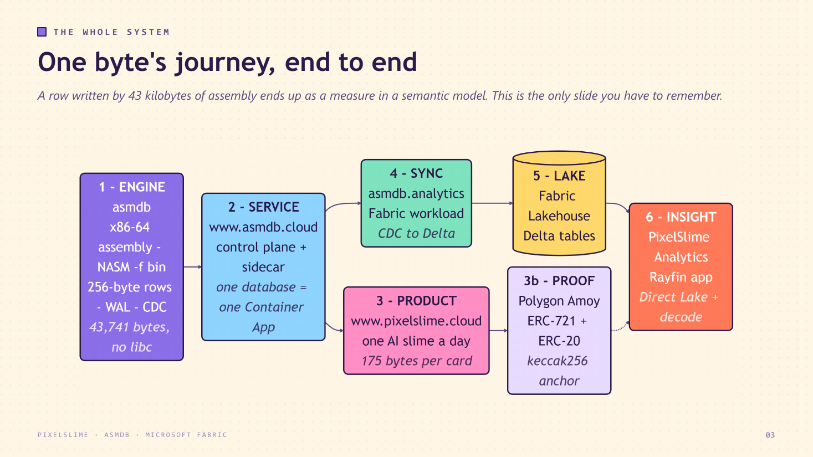

Here is the same journey as it actually looks in production — five products, four screens, one continuous line:

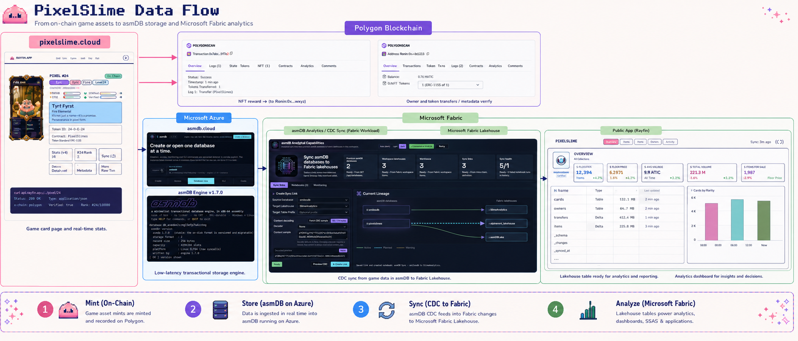

---

## Act 01 — The engine

**Why write a database in assembly in 2026?** Because the moment you refuse a general-purpose runtime, you have to justify every byte you spend — and it turns out most databases spend an enormous number of bytes on things nobody asked for.

asmdb is a single flat file of 256-byte records. That number is not a style choice. Because 256 is a power of two, finding record *N* is a base address plus a shift — two instructions. There is no page table, no extent manager, no buffer pool and no catalog lookup, because **there is nothing to look up, and nothing to look it up in**.

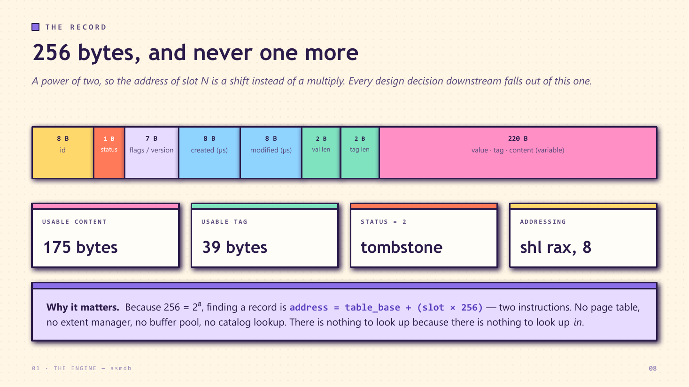

The store *is* the index. A Fibonacci hash of the key lands you directly on a slot, linear probing resolves the collision, and the file is capped at 4,194,304 slots — one gibibyte, 75% usable, 3,145,728 rows. Every one of those numbers is a consequence of the first one.

Durability is equally literal. A commit is not a feeling, it is **a place**: two fsyncs and a sixteen-byte marker. Everything written before that marker can be thrown away without consequence. Everything after it is pure, replayable redo.

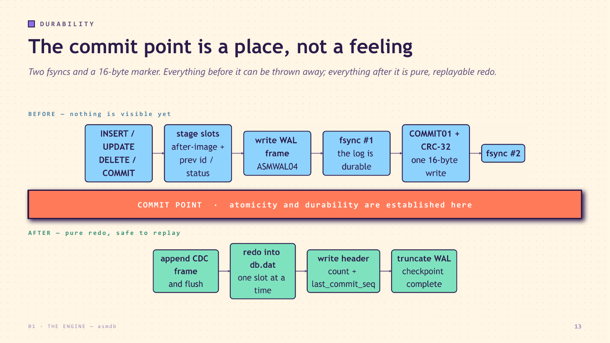

**What it cost, and what it bought.** 43,741 bytes as a Windows PE64 binary. 52,205 bytes as a Linux ELF64 with raw syscalls and no libc at all. Roughly 12.38 million rows per second in RAM — about twelve times SQLite on the same box. Not because the code is clever, but because there is almost nothing between the request and the memory.

---

## Act 02 — The service

An engine nobody can reach is a hobby. **[www.asmdb.cloud](https://www.asmdb.cloud)** is the part that turns a 43 KB binary into something a stranger can provision with a credit card.

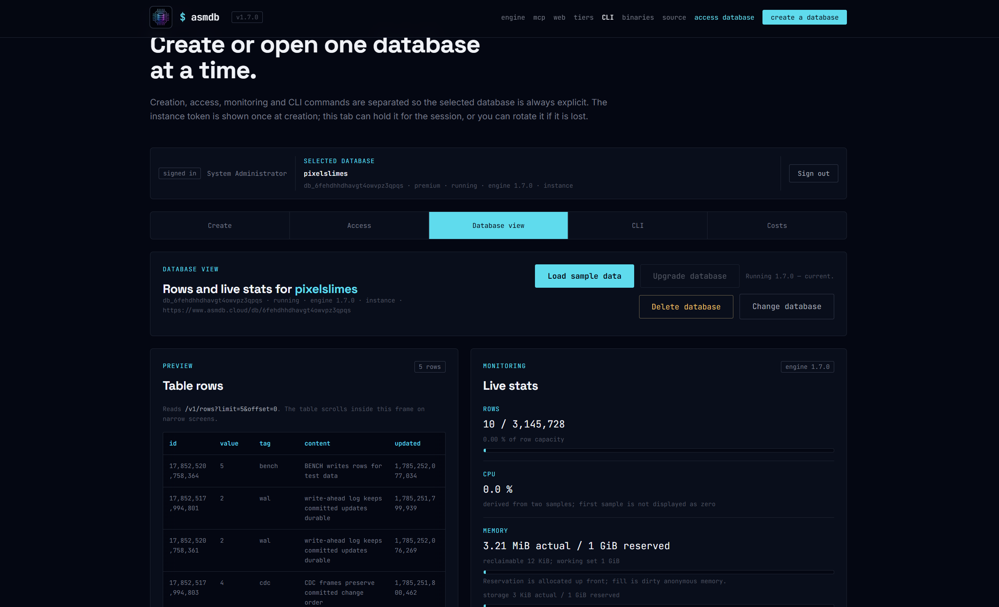

The topology is deliberately boring, and boring is the feature. **API Management is the only thing on the internet.** The control plane, every database instance and all the storage live inside the VNet behind private endpoints. There is exactly one public door.

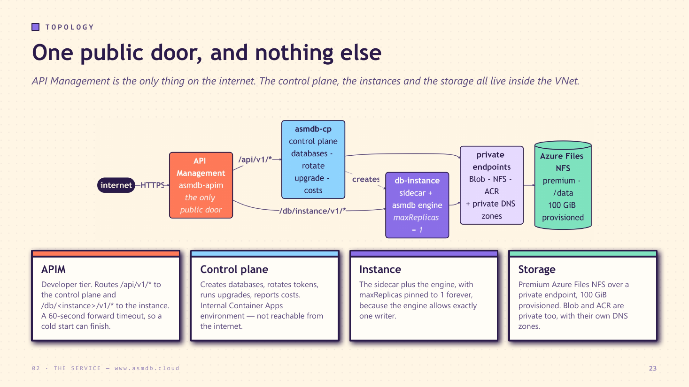

The other decision that shaped everything: **one database equals one Container App**, with replicas pinned to one forever. The engine allows exactly one writer, so instead of building a coordination layer to paper over that, the platform simply agrees with it. The blast radius of any incident becomes exactly one customer. Upgrading becomes changing an image tag.

Three tiers — free, $15 and $49 — sit on top of a platform floor of $141.76 a month. The console keeps creation, access, monitoring and CLI deliberately separate, so the selected database is always explicit and no command can ever run against the wrong instance.

---

## Act 03 — The workload

**asmdb.analytics** is a first-party **Microsoft Fabric workload**. It appears in the workload hub, it installs into a workspace, and it brings its own item type: the *asmDB Sync Hub*.

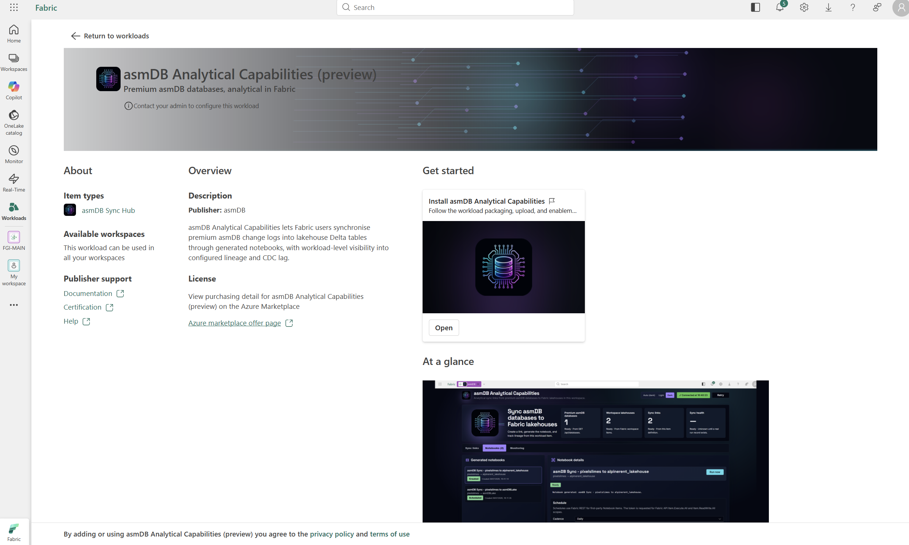

Its job is narrow and honest: take the change data capture stream the engine already writes, and land it in Lakehouse Delta tables. Five moving parts, and each one is somebody's property — ours, or the customer's.

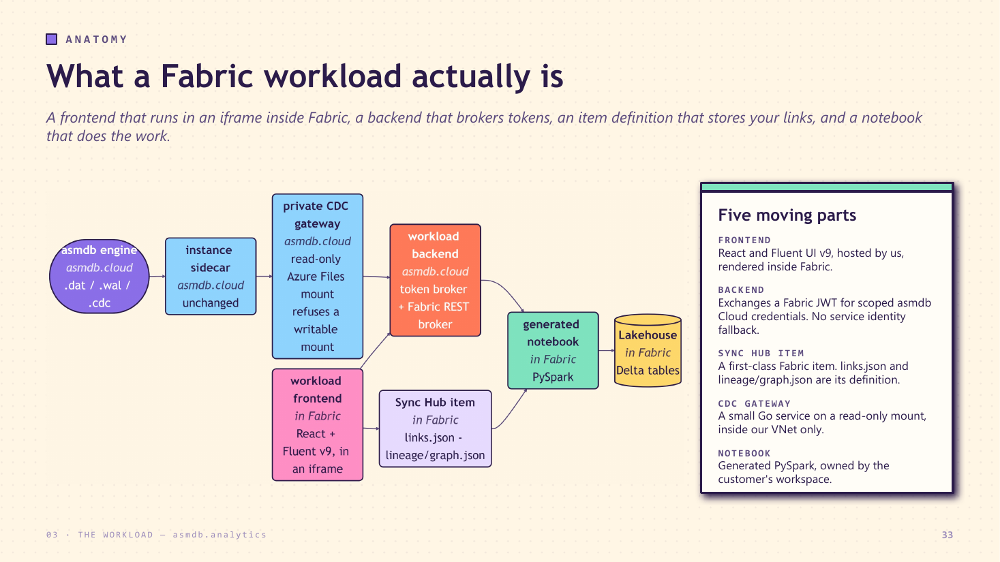

The most important design decision in this act is that the workload **generates a notebook rather than running a job**. The customer can read every line before it touches their data. It executes on their capacity, under their governance, with their identity. They can edit it, fork it, or schedule it from a Data Factory pipeline instead.

And if we disappeared tomorrow, the notebook would still work. That is not a marketing line — it is the actual test we designed against.

---

## Act 04 — The product

Everything above is infrastructure, and infrastructure proves nothing by itself. So we built something that could only exist if all of it worked.

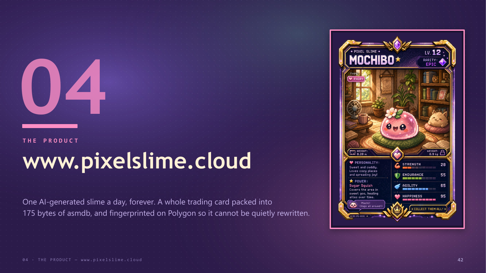

**[www.pixelslime.cloud](https://www.pixelslime.cloud)** blooms one AI-generated slime a day, forever. Every card is a complete trading card — name, level, rarity, type, biome, personality, power, a quote and four stats — and every card must fit into **175 bytes of asmdb content**. Not 176.

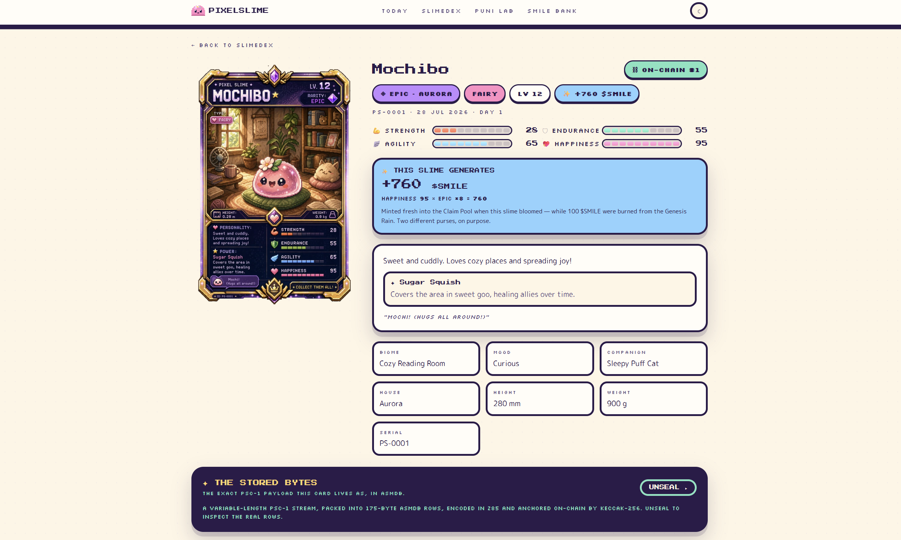

### The generation pipeline

This is the part people assume is a single prompt, and it is not. The obvious approach — paint a beautiful card, then read the stats back off the pixels — is fragile in a specific and fatal way: every card becomes a parsing problem, every font quirk becomes a data bug, and the database ends up believing whatever the renderer happened to draw.

So the pipeline is inverted. **Data first, image second.**

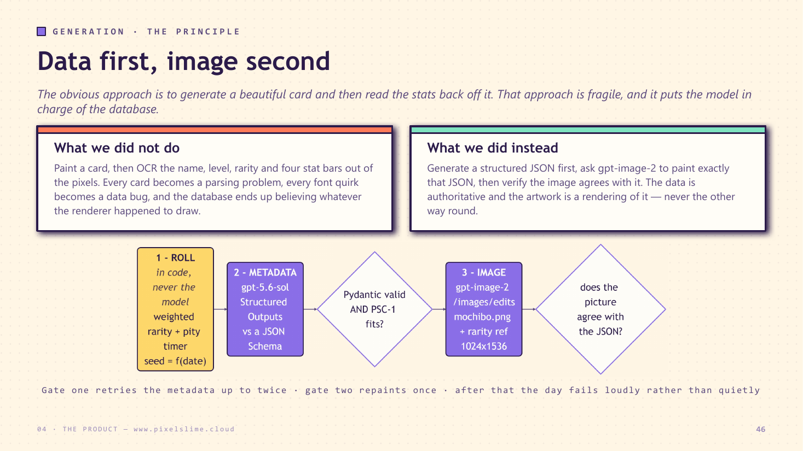

The rarity roll happens **in code, never in the model** — weighted 45 / 27 / 17 / 8 / 2.5 / 0.5 percent across Puddle, Dewdrop, Prism, Aurora, Starlight and Dreamdrop, with a fourteen-day pity timer and a seed derived from the date. Then a language model fills a strict JSON schema for that predetermined rarity. Then an image model is asked to paint *exactly that JSON*, using the original Mochibo card as a structural reference so the frame, the layout and the pixel-art grammar stay consistent across a decade of cards.

The artwork is a **rendering of the data**. It is never the source of it.

Four gates stand between a generated card and a published one, because a missing bloom is embarrassing but a wrong one is permanent:

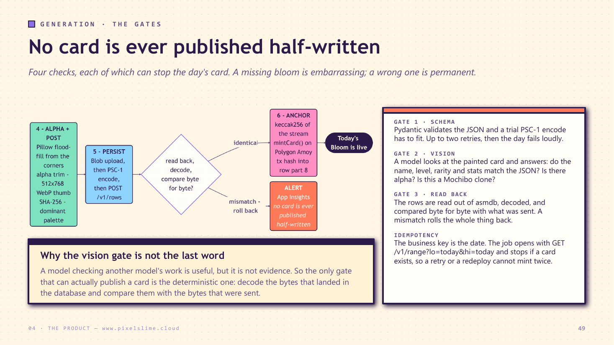

The last gate is the one that actually matters. A model checking another model's work is useful, but it is not evidence. The only gate that can publish a card is the deterministic one: **read the rows back out of asmdb, decode them, and compare byte for byte with what was sent.** A mismatch rolls the whole day back.

### 175 bytes, and the codec that made them possible

A full card is about 660 characters of JSON. The ceiling is 175. That gap is where the most interesting engineering in the project lives.

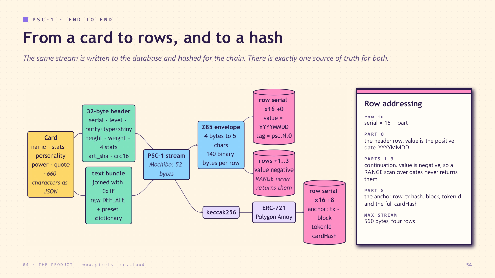

**PSC-1** is a purpose-built codec: a 32-byte binary header carrying serial, level, rarity, type, shiny flag, height, weight, four stats, an art hash and a CRC-16 — then the text fields joined by a unit separator and compressed with raw DEFLATE against a **pinned 3,215-byte dictionary** that ships with every decoder and is hash-checked on every single decode. Finally the whole thing is Z85-encoded, four binary bytes becoming five printable characters.

Mochibo — the card in the banner — compresses to **52 bytes**, 65 characters. From roughly 660.

The same stream is written to the database *and* hashed for the chain. There is exactly one source of truth for both. Cards that overflow one row spill into continuation rows carrying negative values, so a range scan over dates can never accidentally return half a card.

### Two tokens, one letter apart

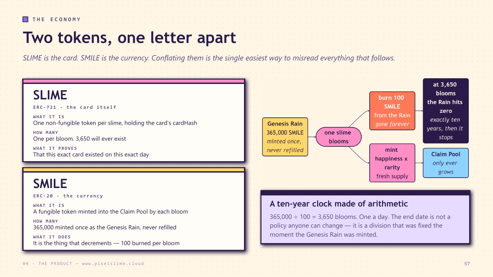

SLIME is the card — one ERC-721 per bloom, holding that card's hash, proving this exact card existed on this exact day. SMILE is the currency — an ERC-20 minted once as a 365,000-token **Genesis Rain** that is never refilled. Every bloom burns 100 SMILE from the Rain.

365,000 ÷ 100 = 3,650 blooms. One a day. Ten years, and then it stops. The end date is not a policy anyone can change — it is a division that was fixed the moment the Genesis Rain was minted.

Four contracts, all live on Polygon Amoy, chain ID 80002.

---

## Act 05 — The payoff

**PixelSlime Analytics** is a Fabric "Rayfin" app. It reads the Lakehouse rows the workload landed, decodes PSC-1 inside the semantic model layer, and turns 140 binary bytes per row back into fourteen KPIs — none of them decorative.

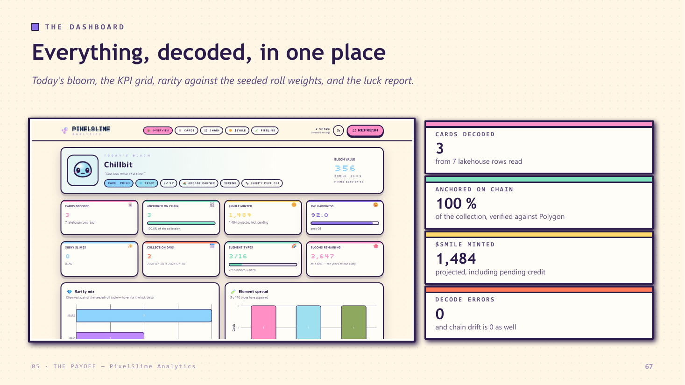

Every tile is derived from decoded bytes or on-chain evidence. Nothing is a placeholder and nothing is rounded up. Cards decoded, percentage anchored on chain, SMILE minted, average happiness, shiny count, element spread, blooms remaining, decode errors, chain drift.

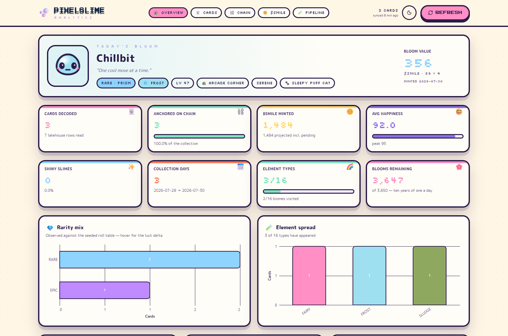

The app also has one page whose entire job is to explain the constraint that shaped the product: a storage-pressure view that plots the largest card in the collection against the 175-character ceiling. When a future slime arrives with a longer name and a wordier power, that chart is where it shows up first — rather than as a failed insert at ten in the morning.

---

## Act 06 — How this was actually built

This is the section people ask about most, so it gets its own act in the deck.

None of this was built by one person typing linearly. It was built by **eleven agent workstreams running in parallel**, coordinated by a single rule that fits in eleven words.

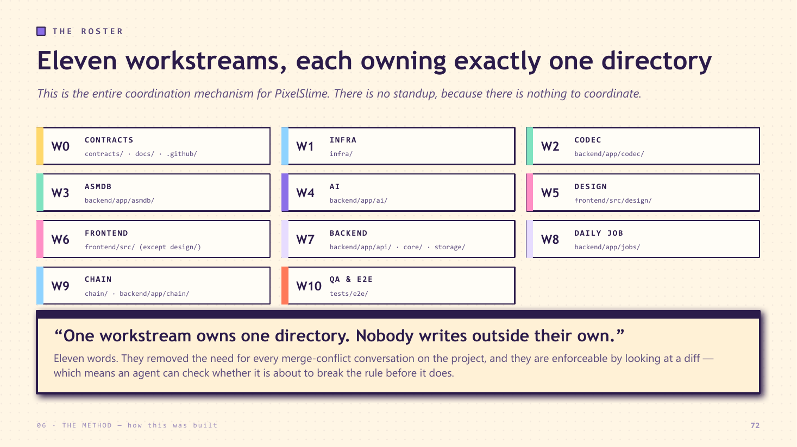

> **One workstream owns one directory. Nobody writes outside their own.**

That is the entire coordination mechanism. There is no standup, because there is nothing to coordinate. The rule is enforceable by looking at a diff — which means an agent can check whether it is about to break the rule *before* it does.

The scaffolding around that rule is equally plain:

- **A written plan before any code.** Every repository carries a plan document and an agent charter that spell out the architecture, the ownership map and the dependency graph between workstreams. Agents read them first, every time.
- **Contracts first.** Workstream zero owns nothing but shared contracts, docs and CI. Every other workstream depends on it, and it depends on nobody. Interfaces are frozen before implementations start, so eleven parallel streams never have to negotiate.
- **Tests as the handshake.** 726 backend tests, 49 chain tests and 24 protocol checks. When a workstream's tests go green, the workstream is done — no review meeting required.
- **Deterministic gates over judgement calls.** Wherever a decision could have been "does this look right?", it was replaced with something a machine can decide. That is why the AI pipeline ends with a byte-for-byte read-back rather than a vibe check.

---

## The argument

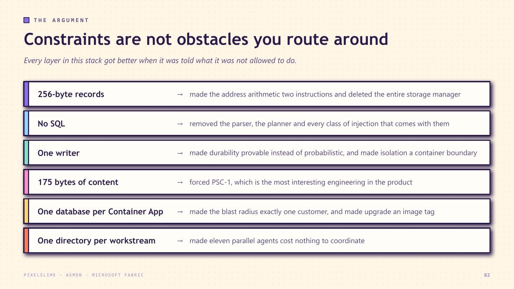

Every layer in this stack got better when it was told what it was **not** allowed to do.

- 256-byte records made the address arithmetic two instructions, and deleted the entire storage manager.
- No SQL removed the parser, the planner, and every class of injection that comes with them.
- One writer made durability provable instead of probabilistic, and made isolation a container boundary.
- 175 bytes of content forced PSC-1, which is the most interesting engineering in the product.
- One database per Container App made the blast radius exactly one customer.
- One directory per workstream made eleven parallel agents cost nothing to coordinate.

That is the whole thesis. The five systems above are the evidence for it.

---

## The deck

A ninety-minute keynote. 84 slides, six acts. It is the long version of everything above, with the numbers, the topologies and the failure modes left intact.

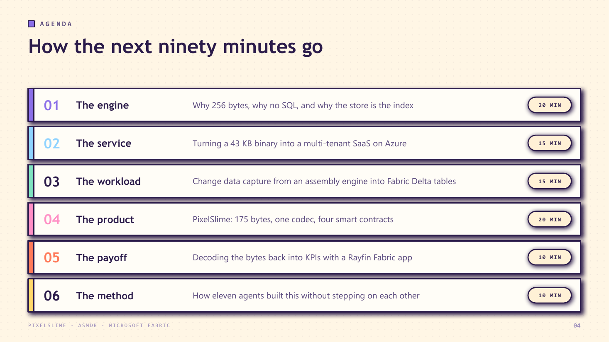

**[⬇ PixelSlime-asmdb-Keynote.pptx](deck/PixelSlime-asmdb-Keynote.pptx)** (41 MB) · **[⬇ PixelSlime-asmdb-Keynote.pdf](deck/PixelSlime-asmdb-Keynote.pdf)** (11 MB)

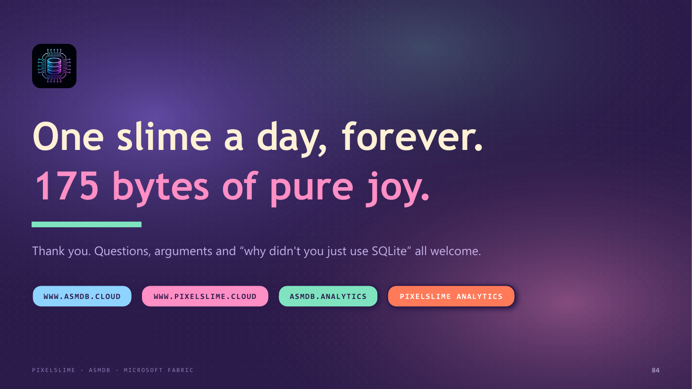

---

## Where to go next

| Repository | What you will find |
|---|---|
| **[fredgis/asmDB](https://github.com/fredgis/asmDB)** | The engine sources, the wire protocol, the SaaS control plane and the Fabric workload. |
| **[fredgis/pixelslime](https://github.com/fredgis/pixelslime)** | The game, the AI generation pipeline, the PSC-1 codec and the four smart contracts. |
| **[fredgis/pixelslimeanalytics](https://github.com/fredgis/pixelslimeanalytics)** | The Fabric Rayfin app, the semantic model, and the decoder that runs inside it. |

And the two things you can go and look at right now:
**[www.asmdb.cloud](https://www.asmdb.cloud)** · **[www.pixelslime.cloud](https://www.pixelslime.cloud)**

 
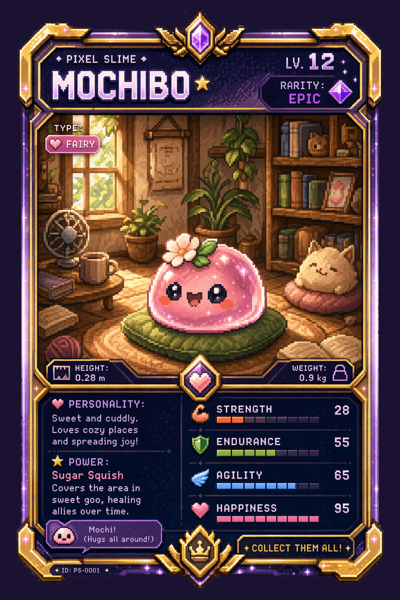
  

**Mochibo · PS-0001 · 52 bytes**

*One slime a day, forever. 175 bytes of pure joy.*

